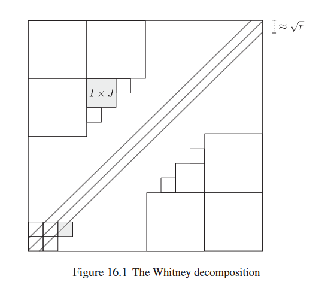

## The Problem Set-up
Falconer's Conjecture asks if
$$\dim{A} > \frac{n}{2} \text{ implies } \mathcal{L}^{1}(D(A)) > 0$$
From Theorem 4.6 in [Mattila][], we already have seen that for a Borel set $A \subset \R^{n}$, we get a positive Lebesgue measure of the distance set whenever $\dim{A} > \frac{n}{2} + \frac{1}{2}$[^1]. We can address the gap in the hypothesis via the following theorem.

**Theorem 15.1** (Wolf-Erdoğan Distance Set Theorem): Let $A \subset \R^{n}$ be a Borel set and $n \geq 2$. 

1. If $\dim A > \frac{n}{2} + \frac{1}{3}$, then $\mathcal{L}^{1}(D(A)) > 0$.
2. If we are in the intermediate case of $\frac{n}{2} \leq \dim{A} \leq \frac{n}{2} + \frac{1}{3}$, then $\dim{D(A)} \geq \frac{6\dim{A}+2-3n}{4}$. 

We aim to summarize the treatment given in Chapters 15 and 16 of [Mattila][]. Further details may be found there.

### Definitions
We can define the quadratic spherical averages of a measure $\mu \in \mathcal{M}(\R^{n})$ for $r > 0$ by
$$\sigma(\mu)(r) = \int_{S^{n-1}}{\abs{\hat{\mu}(r\nu)}^{2}\,d\sigma^{n-1}\nu} = r^{1-n}\int_{S^{n-1}(r)}{\abs{\hat{\mu}(\nu)}^{2} \,d\sigma_{r}^{n-1}\nu}$$

The energy integrals of a measure $\mu$ are
$$I_s(\mu)=\gamma(n, s) \int_0^{\infty} \sigma(\mu)(r) r^{s-1} d r, \quad 0<s<n$$
Recall that $\gamma(n, s)$ is a constant that relies on $n$ and $s$.

We have the induced distance measure $\delta(\mu)$ defined on all continuous functions $\varphi$ from
$$\int{\varphi \,d\delta(\mu)} = \int\int{\varphi(\abs{x-y})\,d\mu x \,d\mu y}$$

The weighted spherical averages $\Sigma(\mu)$ and distance measures $\Delta(\mu)$ are given respectively by $$\Sigma(\mu)(r) = r^{\frac{n-1}{2}}\sigma(\mu)(r)\text{ and }\int \varphi \,d \Delta(\mu)=\int u^{(1-n) / 2} \varphi(u) \,d \delta(\mu)$$

## Some Initial Decomposition

Assume that $I_{\frac{n+1}{2}}(\mu) < \infty$. Then, we can calculate {{< inlineNote "$\Sigma(\mu) \in L^{1}$">}} $$\int_{0}^{\infty}\lvert \Sigma(\mu) \rvert = \int_{0}^{\infty}{\lvert r^{\frac{n-1}{2}} \sigma(\mu)(r) \rvert} \ll \lvert I_{s}(\mu) \rvert < \infty$$ .

We can also get a relationship between the weighted distance measure and weighted spherical averages involving the Bessel function via spherical coordinates.
$$\Delta(\mu)(u) = c(n)\sqrt{u}\int_{0}^{\infty}{\sqrt{r} J_{\frac{n-2}{2}}(2\pi r u) \Sigma(\mu)(r) \,dr}$$

Using an  $$\begin{align*}
J_{m}(u) &= \frac{\sqrt{2}}{\sqrt{\pi u}}\cos(u - \frac{\pi m}{2} - \frac{\pi}{4}) + O(u^{-\frac{3}{2}}) \\
\implies c(n)J_{\frac{n-2}{2}}(2\pi u) &= \frac{\sqrt{2}}{\sqrt{ 2\pi^{2} u}}\cos(2\pi u - \frac{\pi n - 2 \pi}{4} - \frac{\pi}{4}) + O((2\pi u)^{-\frac{3}{2}}) \\
&= \frac{1}{\sqrt{u}}(a_{1}\cos(2\pi u) + b_{1} \sin(2\pi u)) + K(u) \\
\left| K(u) \right| &\lesssim \min\{u^{-\frac{3}{2}}, u^{-\frac{1}{2}}\} \\
\end{align*}$$ 
Here $a_{1}, b_{1}$ are complex constants as the result of cosine difference identity. , we get that $c(n)J_{\frac{n-2}{2}} = \frac{1}{\sqrt{u}}(a_{1}\cos(2\pi u) + b_{1} \sin(2\pi u)) + K(u)$.

For $u > 0$, we want to split our weighted distance measure $\Delta(\mu)(u)$ into the sum of two parts 
$$\begin{align*}
S(\mu)(u) &= a_{2}\int_{0}^{\infty}{\cos(2\pi r u) \Sigma(\mu)(r)\,dr} + b_{2}\int_{0}^{\infty}{\sin(2\pi r u) \Sigma(\mu)(r) \,dr} \\
L(\mu)(u) &= \sqrt{u}\int_{0}^{\infty}{\sqrt{r} \Sigma(\mu)(r) K(ru) \,dr}
\end{align*}$$

If we assume that $\Sigma(\mu) \in L^{2}(\R)$, some additional  Let $\Sigma_{1}(\mu)(r) = \Sigma(\mu)(\left| r\right|)$ and $\Sigma_{2}(\mu)(r) = -\Sigma(\mu)(\left| r \right|)$; these are just the respective even and odd extensions of $\Sigma(\mu)(r)$. Then, for $u > 0$, 
$$\begin{align*}
S(\mu)(u) &= \frac{a_{2}}{2}\int_{-\infty}^{\infty}{\cos(2\pi r u)\Sigma_{1}(\mu)(r)\,dr} + \frac{b_{2}}{2}\int_{-\infty}^{\infty}{\sin{2\pi r u}\Sigma_{2}(\mu)(r) \,dr} \\
&= \frac{a_{2}}{2}\int_{-\infty}^{\infty}{e^{-2\pi i\mkern{1mu} r u}\Sigma_{1}(\mu)(r)\,dr} + \frac{i\mkern{1mu} b_{2}}{2}\int_{-\infty}^{\infty}{e^{2\pi i\mkern{1mu} r u}\Sigma_{2}(\mu)(r) \,dr}
\end{align*}$$

Returning to $\Delta(\mu)(u) = S(\mu)(u) + L(\mu)(u)$, if the LHS equals $0$ (which is the case when $u < 0$), we can define $S(u) = L(\mu)(u)$ when $u < 0$. Thus, we get to break up $S(\mu)(u)$ based on sign into 

$$\begin{align*}
    S(\mu)(u) &= \frac{a_{2}}{4}A[1 + \text{sgn}(u)] + \frac{i \mkern{1mu} b}{4}B[1 + \text{sgn}(u)] \\
    &= (1 + \text{sgn}(u))[\frac{a_{2}}{4}A + \frac{i \mkern{1mu} b}{4}] \\
    A &= \int_{-\infty}^{\infty}{e^{-2\pi i \mkern{1mu} r u} \Sigma_{1}(\mu)\,dr} \\
    B &= \int_{-\infty}^{\infty}{e^{-2\pi i \mkern{1mu} r u} \Sigma_{2}(\mu)\,dr}
    \end{align*}$$

Now, the Hilbert transform ($\hat{Hf} = -i \mkern{1mu} \text{sgn}{\hat{f}}$) is an isometric mapping in $L^{2}$-norm since the Fourier transform is.
 tells us that
$$S(\mu) = \mathcal{F}(a_{3}[\Sigma_{1}(\mu) + \iu H(\Sigma_{1}(\mu))] + b_{3}[\Sigma_{2}(\mu) + \iu H(\Sigma_{2}(\mu))])$$
If we suppose $s \in [\frac{n-1}{2}, \frac{n+1}{2}]$ and let $a = \frac{n+1}{2} - s$,  
$$\begin{aligned}
|L(\mu)(u)| &= \left|\sqrt{u} \int_0^{\infty}\sqrt{r}\Sigma(\mu)(r)K(ru) \,dr\right| \\
&\lesssim \int_0^{1 / u} r^{\frac{n-2}{2}} \sigma(\mu)(r) \,dr + u^{-1} \int_{\frac{1}{u}}^{\infty} r^{\frac{n-3}{2}} \sigma(\mu)(r) \,dr \\
&= u^{-a} \int_0^{\frac{1}{u}}(r u)^a r^{\frac{n-1}{2}-a} \sigma(\mu)(r) d r + u^{-a} \int_{\frac{1}{u}}^{\infty}(r u)^{a-1} r^{\frac{n-1}{2} - a} \sigma(\mu)(r) d r \\
&\leq u^{-a} \int^{\infty} r^{s-1} \sigma(\mu)(r) \,dr \\
&= \gamma(n, s)^{-1} u^{s-\frac{n+1}{2}} I_s(\mu)
\end{aligned}$$

$$\abs{L(\mu)(u)} \lesssim \gamma(n, s)^{-1} u^{s-\frac{n+1}{2}}I_{s}(\mu)$$

### Bounding via Plancherel's

**Proposition 15.2** - Suppose that $\mu \in M(\R^{n})$, $n \geq 2$, $s > 0$ and $I_{s}(\mu) < \infty$. 
1. If $s > \frac{n}{2}$ and $\int_{1}^{\infty}{\sigma(\mu)(r)^{2}r^{n-1} \,dr} < \infty$ (in other words, $\Sigma(\mu) \in L^{2}(\R)$), then $\Delta(\mu) \in L^{2}(\R)$. Furthermore, $\delta(\mu) \ll \mathcal{L}^{1}$.
2. If $0 < t < 1$, $s > \frac{n+t - 1}{2}$ and $\int_{1}^{\infty}{\sigma(\mu)(r)^{2}r^{n + t - 2} \,dr} < \infty$, then $I_{t}(\Delta(\mu)) < \infty$. 

 

Let's start by proving (1). Since $I_{s}(\mu) < \infty \implies I_{t}(\mu) < \infty$ for all $t < s$, we can assume that $s < \frac{n+1}{2}$. Using a nice approximation to the identity $\epsilon$, define $\mu_{\epsilon} = \psi_{\epsilon} \ast \mu$. Using our previous rewriting of $S(\mu)$ and Plancherel's, we get
$$\lVert S(\mu_{\epsilon}) \rVert \lesssim \lVert \Sigma(\mu_{\epsilon})\rVert_{2} \leq \lVert \Sigma(\mu) \rVert_{2} < \infty$$

We can now bound $L(\mu_{\epsilon})$, the other part of $\Delta(\mu)$. Using the previously established inequality, we can square and integrate both sides to yield
$$\int_{0}^{1}(L(\mu_{\epsilon} (u)^{2})\,du) \lesssim \int_{0}^{1}{u^{2s-n-1}\,du I_{s}(\mu_{e})^{2}} \lesssim I_{s}(u)^{2}$$
Since $2s > n$ and plugging in the special case of $s = \frac{n-1}{2}$ as in the previous identity, we can find that the other part of the integral is also square integrable.
$$\int_{1}^{\infty}(L(\mu_{\epsilon} (u)^{2})\,du) \lesssim \int_{-1}^{\infty}{u^{-2}\,du I_{s}(\mu_{e})^{2}} \lesssim I_{s}(u)^{2}$$

Combining these estimates gives us $\Delta(\mu_{\epsilon}) \in L^{2}(\R)$, which extend to the desired bound.

\
 
We need to assume a lemma called A_{2} weight inequality for $0 < t \leq 1$.
$$\int_{-\infty}^{\infty}{\lvert r \rvert^{t-1} \lvert Hf(r)\rvert^{2}\,dr} \lesssim_{t} \int_{-\infty}^{\infty}{\lvert r \rvert^{t-1}\lvert f(r)\rvert^{2}\,dr}$$

Let $\mu$ be a smooth, non-negative function $f$ with compact support. We can use the following estimates for $S(f)$ and $L(f)$. 
$$\begin{align*} 
\lvert L(f)(u) \rvert \lesssim \lvert u \rvert^{-1} \\
\lvert S(f)(u) \rvert \lesssim \lvert u \rvert^{-1}
\end{align*}$$
In particular, this means that at least for sufficiently nice $f$, these are in $L^{2}(\R)$. Now, to extend this to general $\mu$, we want to use the fact that $\int_0^{\infty} v^{-a}|u-v|^{-b} d v \approx u^{1-a-b} \text { for } u>0, a, b \in(0,1)$ and an approximation to the identity $f = \psi_{\epsilon} \ast \mu$.


### Strengthening the Result
A little bit more work gives us the following.[^2]

**Proposition 15.3** - Suppose that $C$, $s$ and $t$ are positive numbers, $t \leq s$, and $\mu \in \mathcal{M}(\R^{n})$, $n \geq 2$, are chosen such that $I_{s}(\mu) < \infty$ and $\sigma(\mu)(r) \leq Cr^{-t}$ for all $r > 0$. Then,
1. If $s + t \geq n$, then $\mathcal{L^{1}(D(\text{spt}\mu))} > 0$. 
2. If $s + t < n$, then $\dim{D(\text{spt}\mu)} \geq s + t - n + 1$


This is relatively straightforward. We can calculate that
$$\begin{aligned}
& \int_1^{\infty} \sigma(\mu)(r)^2 r^{n-1} d r \leq C \int_1^{\infty} \sigma(\mu)(r) r^{n-1-t} d r \\
& =\gamma(n, n-t) C I_{n-t}(\mu) \lesssim I_s(\mu)<\infty
\end{aligned}$$
Then, using the result established in Proposition 15.2 (1), we get $\delta(\mu) \ll \mathcal{L}^{1}$. Just by the contrapositive of the definition of absolute continuity, $\mathcal{L}^{1}(D(\text{spt}\mu)) > 0$.

\

Let $u = s + t - n + 1 < 1$. We can assume WLOG that $u > 0$ and $t < s$. Now, rearrangement gives, $s > \frac{s + t}{2} = \frac{n + u - 1}{2}$. Applying part (2) of Proposition 15.2, we find that 
    $$\begin{aligned}
& \int_1^{\infty} \sigma(\mu)(r)^2 r^{n+u-2} d r=\int_1^{\infty} \sigma(\mu)(r)^2 r^{s+t-1} d r \\
& \quad \leq C \int_1^{\infty} \sigma(\mu)(r) r^{s-1} d r=\gamma(n, s)^{-1} C I_s(\mu)<\infty
\end{aligned}$$
This precisely means that $I_{u}(\Delta(\mu)) < \infty$, so the dimension of $D(\text{spt}\mu) \geq u$.


## Some Motivation for Next Steps

How can we improve the previous results to get Theorem 15.1? Well, the key in most of our propositions above is getting a handle on $\sigma(\mu)(r)$ (notice how it appears in our decomposition of $\Delta(\mu)$). Ideally, estimates of the form $\sigma(\mu)(r) \lesssim r^{-t}I_{s}(\mu)$ are very useful. So far, in our reading, the best estimate was
$$\sigma(\mu)(r) \leq C(s, t) I_s(\mu) r^{-(n-1) / 2} \quad \text { for } s \geq(n-1) / 2$$. 

If we had a particular estimate, combining it with Proposition 15.3 would yield 15.1 (foreshadowing).

### The Missing Step

In the early 2000's, Wolff (in $n=2$) & Erdoğan (for $n \geq 2$) proved the following.
**Theorem 15.5** - For all $\frac{n-2}{2} \leq s < n$, $n \geq 2$, $\epsilon > 0$ and $\mu \in \mathcal{M}(\R^{n})$ with spt$\mu \subset B(0, 1)$, we have for $r > 1$
$$\sigma(\mu)(r) \leq C(n, s, \epsilon)r^{\epsilon - \frac{n + 2s - 2}{4}}I_{s}(\mu)$$

In the above bound, comparing the exponents, we get something along the lines of $\epsilon + \frac{n - 2s}{4} \leq \frac{1}{4} + \epsilon$. How do we know that this is sharp[^3]?

## Sketching How to Prove Wolff-Erdoğan in dimension 2
We can prove an almost equivalent result.
**Theorem 16.1** - For any $s \in [\frac{n-2}{2}, n]$, $n \geq 2$, $\epsilon > 0$ and every $\mu$ with support inside $B_{1}(0)$, if we have
$$\mu(B_{q}(x)) \leq q^{s} \text{ for all } x \in \R^{n}, q > 0$$
, then the spherical averages satisfy
$$\sigma(\mu)(r) \leq C(n, s, \epsilon)\mu(\R^{n})r^{\frac{n+2s-2}{4}}$$ for $r > 1$. 


First, we reduce integrating over a sphere to integrating over the annuli $A_{r} = \{x \in \R^{n} \lvert r - 1 < \lvert x \rvert < r + 1\}$. We roughly have that $\sigma(\mu)(r) \approx \int_{A_{r}}{\lvert \hat{\mu}^{2} \rvert \,dr}$. By duality, this reduces to
$$\int|\widehat{f}|^2 d \mu \lesssim r^{\varepsilon+(3 n-2 s-2) / 4}, \text{ where } \lVert f \rVert_{2} = 1 \text{ and spt} f \subset A_{r}$$

Next, let's look at the figure below. We take a "cube" $I_{0}$ with diameter ~$r$. Consider the product $I_{0} \times I_{0}$ minus the diagonal. If we assume that the support of $f$ is in the part of A_{r} above $I_{0}$. 

We can get to the following decomposition:
$$\widehat{f}(\xi)^2=\sum_{k=k_n}^{k_r} \sum_{I \times J \in \mathcal{E}_k} \widehat{f}_I(\xi) \widehat{f}_J(\xi)+\sum_{I \times J \in \mathcal{E}} \widehat{f}_I(\xi) \widehat{f}_J(\xi)$$

Above, $f_{I} = f_{\chi_{A_{r}(I)}}$ (in other words, $f_{I}$ is the restriction to the region of the annulus over the cube). We also take our special regions $A_{r}(I)$ to be dyadic of diameter $\frac{r}{2^{k}}$ with seperation of the same $\frac{r}{2^{k}}$. 

Since there are only $\lesssim \log{r}$ values for $k$, we only need to bound each term for the first sum. The desired bound to show now is that for any fixed "rectangle" $I \times J$,
$$\int\left|\widehat{f}_I \widehat{f}_J\right| d \mu \lesssim r^{\varepsilon+(3 n-2 s-2) / 4}\left\|f_I\right\|_2\left\|f_J\right\|_2$$


For some visual references, see [^4] and [^5].

### A Double Decomposition

If we think of the convolution $f_{I} \ast f_{J}$, then the support is in a rectangle $R_{I, J}$ with most of the sides of length $c\frac{r}{2^{k}}$. In fact, $n-1$ of them are, and the remaining length is $\frac{cr}{2^{2k}}$. If we take a smooth approximation $\phi_{R_{I, J}}$ of $\chi_{R_{I, J}}$, then
$$\int \lvert \hat{f_{I}} \hat{f_{J}}\rvert \,d\mu \leq \int \lvert \hat{f_{I}}\hat{f_{J}}\rvert \,d\mu_{R_{I, J}}$$

We've already decomposed once into rectangles. Let's do it a second time now. This second time, we cut into boxes $P$ having
- $n-1$ with length $\frac{c}{2^{-k}}$
- one side with length $c$

Now, we can estimate with a smooth approximation $\psi_{P}$ and $\widehat{f_{I, P}} = \psi_{P}\widehat{f_{I}}$.

$$\begin{aligned}
\int\left|\widehat{f}_I \widehat{f}_J\right| d \mu & =\int\left|\mathcal{F}\left(\varphi_{R_{I, J}} \cdot\left(f_I * f_J\right)\right)\right| d \mu \\
& \lesssim \sum_{P \in \mathcal{P}}\left(\int\left|\widehat{f_{I, P}} \widehat{f_{J, P}}\right|^2\right)^{\frac{1}{2}}\left(\int\left(\mu_{R_{I, J}} \psi_P\right)^2\right)^{\frac{1}{2}}
\end{aligned}$$

### Finishing if n = 2
 We can do 

From a previous chapter to the second term:

$$\int{(\mu_{R_{I,J}}\psi_{P})^{2}} \lesssim r^{2-s}2^{-k}$$

For the first factor, we want to thicken the annuli $A_{r}(I)$ while maintaining the diameters and separation of $\frac{r}{2^{-k}}$. Then, with an angle of $2^{-k}$, we get
$$\mathcal{L}^{2}((-\hat{A}_{r}(I) + x) \cap \hat{A}_{r}(J)) \lesssim 2^{k}$$

, $$\int\left|\widehat{f_{I, P}} \widehat{f_{J, P}}\right|^2 \lesssim 2^k \int\left|f_{I, P}\right|^2 \int\left|f_{J, P}\right|^2$$

If the reader wants more rigor, they are encouraged to look at Page 204 of [Mattila][].

The proof for $n > 2$ requires a "deep bilinear estimates" that won't be discussed until Chapter 25. 

## Wrapping it all up

We note that this Theorem 16.1 implies Theorem 15.1 by using Frostman's lemma + Proposition 15.3 + the hypothesis 
$$\mu(B_{q}(x)) \leq q^{s} \text{ for all } x \in \R^{n}, q > 0 \implies I_{t}(\mu) < \infty$$.

On the other hand, it does not yet show Theorem 15.5, since finite measures may not yield uniform bounds on the growth of balls. How can we solve this problem? We break it into cases by assuming that $\mu(B_{q}(x)) \leq q^{s}$ for $q \geq \frac{1}{r}$. Then, for all other $q < \frac{1}{r} \iff r < \frac{1}{q}$, we try to decompose into $\log{r}$ number of measures with the $g \geq \frac{1}{r}$ condition. Then, some summation estimation yields the desired result.

[Mattila]: https://www.cambridge.org/core/books/fourier-analysis-and-hausdorff-dimension/78A25BED2C6E4F9B911971305DC928B0

[^1]: Above, and for the rest of this blog post, $\dim{A}$ represents the Hausdorff measure of $A$ 

[^2]: In fact, this proves Falconer's Conjecture in the case of Borel Salem sets.

[^3]: We can look at the counterexamples given on Page 209.

[^4]: 

[^5]: 
